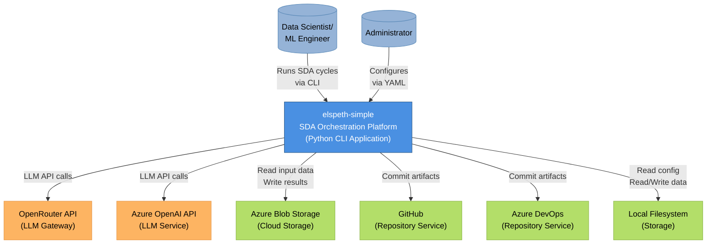
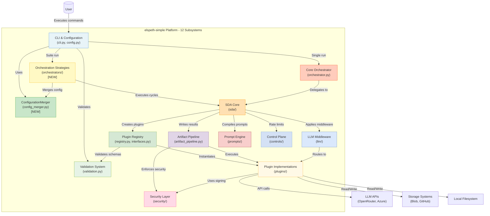
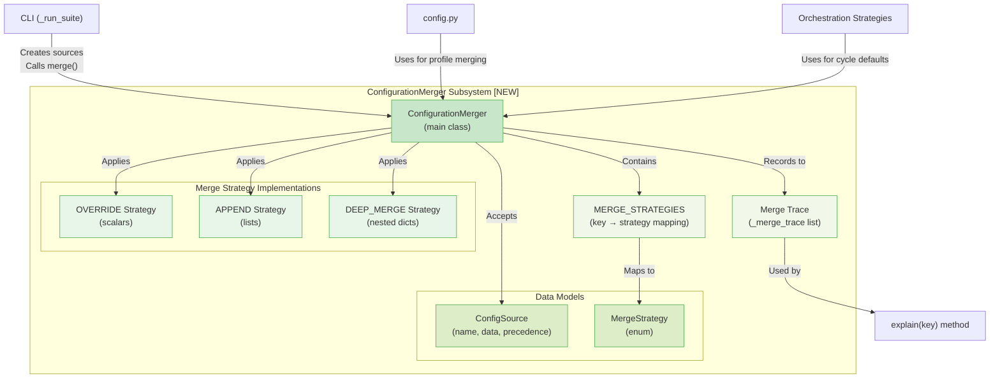
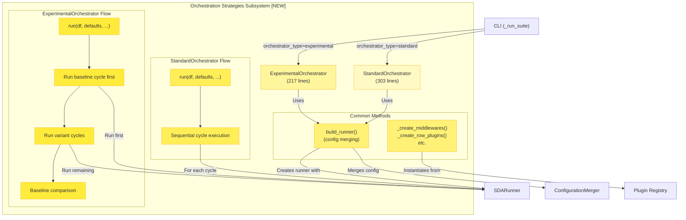
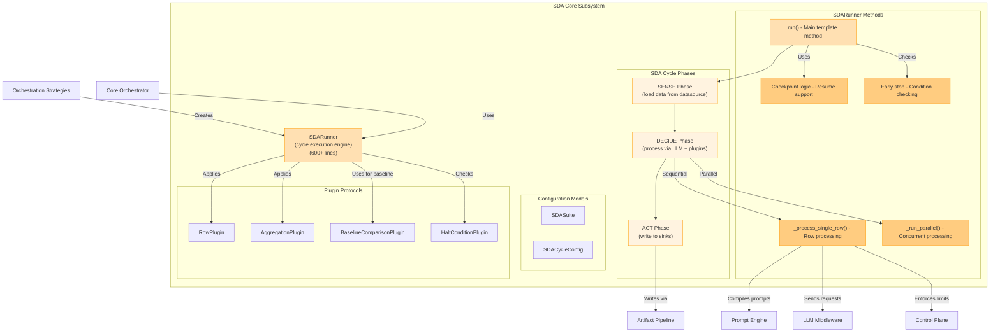

# Architecture Diagrams

**Analysis Date:** 2025-11-14
**Workspace:** docs/arch-analysis-2025-11-14-1201/
**Analyst:** Claude (System Archaeologist)

This document provides C4 architecture diagrams at Context, Container, and Component levels for the elspeth-simple system, reflecting the current architecture with recent refactorings.

---

## Context Diagram (C4 Level 1)

**Title:** elspeth-simple - Sense/Decide/Act Orchestration Platform

**Description:**

The elspeth-simple system is a Python-based CLI application for running **Sense/Decide/Act (SDA)** cycles on datasets. Users (data scientists and ML engineers) interact through command-line interface, while administrators configure via hierarchical YAML files.

**Key interactions:**
- **SENSE** - Load data from datasources (Azure Blob, local CSV, custom)
- **DECIDE** - Process through LLM providers (OpenRouter, Azure OpenAI) or custom logic
- **ACT** - Output to multiple sinks (GitHub, Azure DevOps, blob storage, local files)

**Security context:** Designed for official-sensitive environments with HMAC signing, input validation, and security-level metadata.

---

## Container Diagram (C4 Level 2)

**Title:** elspeth-simple Internal Subsystems and Dependencies

**Description:**

The Container diagram shows the 12 major subsystems with **2 new subsystems** added in recent refactoring:

**New Subsystems (Nov 13-14, 2025):**
1. **ConfigurationMerger** [NEW] - Centralized config merging with merge trace debugging
2. **Orchestration Strategies** [NEW] - Pluggable strategies (Standard vs Experimental)

**Changed Subsystems:**
3. **CLI & Configuration** - Enhanced with --print-config, --explain-config flags
4. **SDA Core** - Renamed from "Experiment", SDASuiteRunner deprecated

**Unchanged Subsystems (8):**
5. Core Orchestrator, 6. Plugin Registry, 7. Artifact Pipeline, 8. LLM Middleware,
9. Prompt Engine, 10. Control Plane, 11. Security Layer, 12. Validation System

**Key architectural change:** Configuration complexity addressed via ConfigurationMerger, orchestration patterns clarified via strategy pattern.

---

## Component Diagram (Level 3) - ConfigurationMerger

**Title:** ConfigurationMerger Internal Structure

**Description:**

ConfigurationMerger is a **new subsystem** introduced Nov 13, 2025 to centralize all configuration merging logic.

**Core functionality:**

1. **merge(*sources)** - Main entry point
   - Accepts variable ConfigSource objects with precedence levels
   - Sorts by precedence (1=lowest to 5=highest)
   - Applies appropriate merge strategy per key
   - Returns merged dictionary

2. **Three merge strategies:**
   - **OVERRIDE** - Higher precedence replaces lower (for scalars like strings, ints)
   - **APPEND** - Accumulates from all sources (for lists like plugins)
   - **DEEP_MERGE** - Recursive merge (for nested dicts like llm.options)

3. **Merge trace debugging:**
   - Records every merge operation with source and strategy
   - `explain(key)` method shows configuration provenance
   - Supports --explain-config CLI flag

**Key pattern:** Strategy pattern with three algorithms, precedence-based sorting, trace debugging for transparency.

**Addresses:** Prior architectural concern about "Configuration Complexity and Merging Logic"

---

## Component Diagram (Level 3) - Orchestration Strategies

**Title:** Orchestration Strategies Internal Structure

**Description:**

Orchestration Strategies is a **new subsystem** introduced Nov 13, 2025 to provide pluggable orchestration patterns for multi-cycle execution.

**Two strategies:**

1. **StandardOrchestrator** (303 lines)
   - Simple sequential execution
   - Each cycle independent
   - No cross-cycle dependencies
   - Use case: Multiple unrelated SDA cycles

2. **ExperimentalOrchestrator** (217 lines)
   - A/B testing with baseline comparison
   - First cycle = baseline
   - Remaining cycles = variants
   - Automatic comparison against baseline
   - Use case: Comparing prompts, models, or configurations

**Common patterns:**
- Both use `build_runner()` which:
  - Merges defaults + prompt pack + cycle config via ConfigurationMerger
  - Instantiates plugins via Registry
  - Creates SDARunner for cycle execution
- Both implement `run(df, defaults, sink_factory, preflight_info)` interface
- Sink factory pattern for per-cycle isolation

**Replaces:** Deprecated SDASuiteRunner (was monolithic, now decomposed into strategies)

---

## Component Diagram (Level 3) - SDA Core

**Title:** SDA Core - Sense/Decide/Act Cycle Execution

**Description:**

SDA Core implements the **Sense/Decide/Act cycle execution pattern** (renamed from "Experiment" terminology Nov 13, 2025).

**Three-phase cycle:**

1. **SENSE** - Load and prepare input data
   - Loads DataFrame from datasource plugin
   - Filters already-processed rows (checkpoint)
   - Prepares for decision-making

2. **DECIDE** - Process data through decision systems
   - Compiles Jinja2 prompt templates
   - Sends requests through LLM middleware to LLM client
   - Applies row plugins for metrics/transformations
   - Sequential or parallel processing (ThreadPoolExecutor)
   - Rate limiting and cost tracking
   - Early stopping condition checks

3. **ACT** - Output results to sinks
   - Applies aggregation plugins
   - Writes results via artifact pipeline
   - Resolves sink dependencies (DAG)

**Key capabilities:**
- Checkpoint/resume for long-running cycles
- Retry logic with exponential backoff
- Parallel row processing
- Plugin lifecycle management
- Early stopping conditions

**Concerns:** SDARunner complexity (600+ lines) - see docs/plans/2025-11-13-refactor-runner-god-class.md for planned refactoring

---

## Diagram Selection Rationale

**Three component diagrams selected:**

1. **ConfigurationMerger** - NEW subsystem showing merge strategies and debugging
2. **Orchestration Strategies** - NEW subsystem showing standard vs experimental patterns
3. **SDA Core** - Core execution showing Sense/Decide/Act cycle pattern

**Why these:**
- Represent the most significant recent architectural changes
- ConfigurationMerger addresses major technical concern from prior analysis
- Orchestration Strategies demonstrates strategy pattern and A/B testing
- SDA Core shows the fundamental execution model

**Why not others:**
- Plugin Registry, Artifact Pipeline, LLM Middleware - Unchanged since prior analysis
- Control Plane, Security, Validation - Smaller, well-understood patterns
- CLI, Core Orchestrator - Thin layers, limited internal complexity

These three diagrams represent the **architectural evolution** and show the system's current state.

---

## Confidence Assessment

**Diagram Confidence Levels:**

- **Context Diagram:** High - External systems verified from plugin implementations and configuration
- **Container Diagram:** High - All 12 subsystems from catalog, dependencies verified through code reading and prior docs
- **ConfigurationMerger Component:** High - Complete file read (211 lines), understand merge strategies, trace pattern
- **Orchestration Strategies Component:** High - Read both implementations (520 total lines), verified interface consistency
- **SDA Core Component:** Medium-High - Based on prior analysis plus verified renaming/deprecation changes

**Overall Confidence:** High - Diagrams accurately reflect current architecture with recent refactorings

---

**Status:** Architecture diagrams complete, ready for validation
