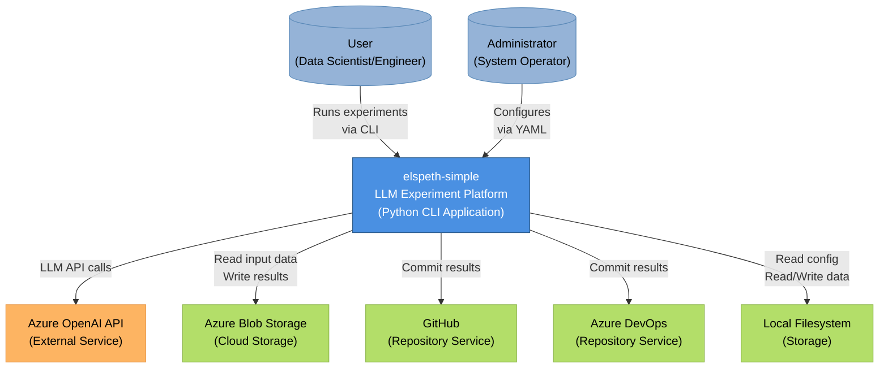
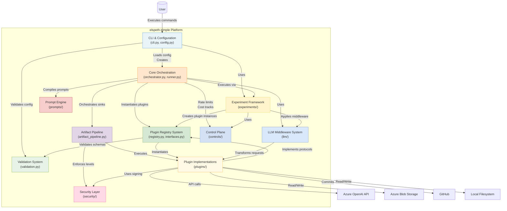
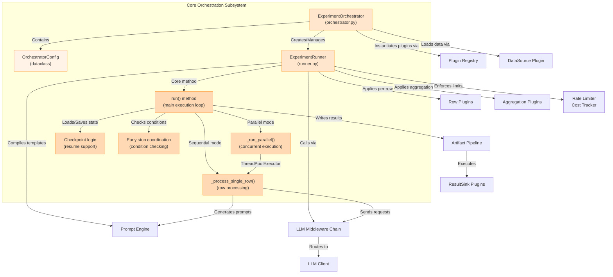
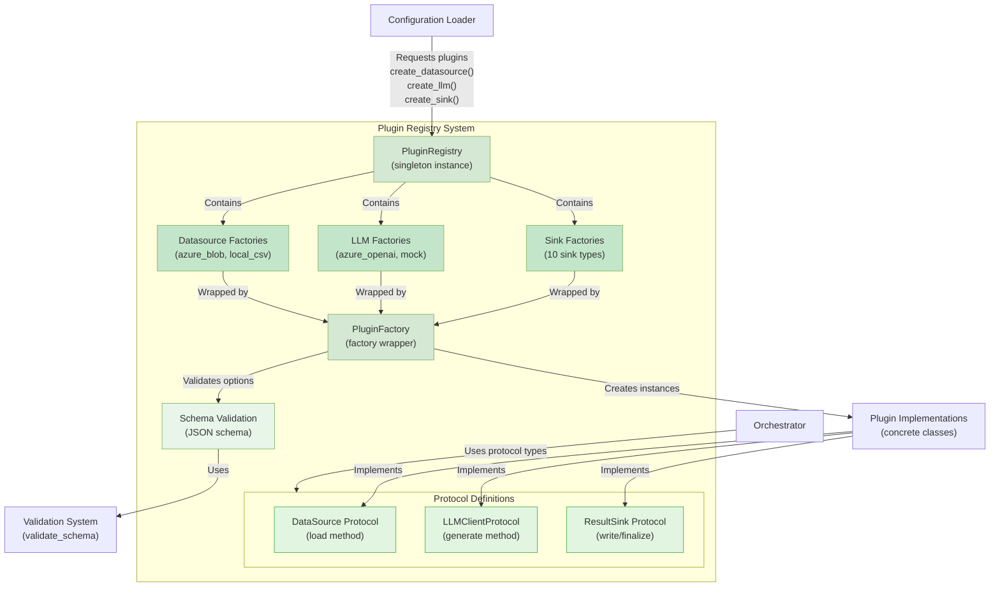
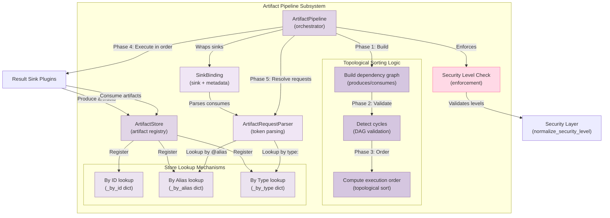

# Architecture Diagrams

This document provides C4 architecture diagrams at Context, Container, and Component levels for the elspeth-simple system.

## Context Diagram (C4 Level 1)

**Title:** elspeth-simple LLM Experiment Platform - System Context

**Description:**

The elspeth-simple system is a Python-based CLI application for running LLM experiments on datasets. Users (data scientists and engineers) interact with the system through command-line interface to execute experiments, while administrators configure the system via YAML files.

The system integrates with several external services:
- **Azure OpenAI API** - Provides LLM inference capabilities for processing prompts
- **Azure Blob Storage** - Stores input datasets and experimental results in the cloud
- **GitHub/Azure DevOps** - Receives committed experiment results and artifacts
- **Local Filesystem** - Reads configuration files and datasets, writes results locally

**Legend:**
- Blue box: The system under consideration
- Light blue actors: Human users of the system
- Orange box: External API service (LLM provider)
- Green boxes: Storage and repository systems

---

## Container Diagram (C4 Level 2)

**Title:** elspeth-simple Internal Subsystems and Dependencies

**Description:**

The Container diagram shows the 11 major subsystems within elspeth-simple and their relationships:

**Entry Flow:**
1. **CLI & Configuration** - Entry point that parses arguments, loads YAML configuration with profile merging, and delegates to appropriate execution path
2. **Validation System** - Validates configuration files and plugin options against JSON schemas before execution

**Core Execution Path:**
3. **Core Orchestration** - Main orchestrator coordinating the experiment lifecycle (data load → LLM processing → result output)
4. **Experiment Framework** - Manages experiment suites, plugin lifecycle, and baseline comparisons
5. **Plugin Registry System** - Factory registry that validates and instantiates all plugin types (datasources, LLMs, sinks)

**Supporting Services:**
6. **Prompt Engine** - Compiles and renders Jinja2-based prompt templates with variable substitution
7. **LLM Middleware System** - Request/response transformation pipeline for logging, filtering, and content modification
8. **Control Plane** - Operational controls for rate limiting and cost tracking
9. **Artifact Pipeline** - Resolves sink dependencies via topological sort and manages artifact production/consumption
10. **Security Layer** - HMAC signing and security level enforcement

**Plugin Implementations:**
11. **Plugin Implementations** - Concrete implementations of datasources (CSV, Blob), LLM clients (Azure OpenAI, Mock), output sinks (11 types), and experiment plugins (metrics, early stopping)

**Legend:**
- Solid arrows: Direct dependencies and data flow
- Different colors: Distinguish subsystem categories
- External systems (bottom): Cloud services and storage

---

## Component Diagram (C4 Level 3) - Core Orchestration

**Title:** Core Orchestration Internal Structure

**Description:**

The Core Orchestration subsystem is the heart of the experiment execution engine. Key components:

**High-Level Orchestrator:**
- **ExperimentOrchestrator** - Top-level coordinator that wires together datasource, LLM client, sinks, and configuration. Delegates actual execution to ExperimentRunner.
- **OrchestratorConfig** - Dataclass holding all configuration parameters (prompts, fields, plugins, retry settings, etc.)

**Execution Engine:**
- **ExperimentRunner** - Low-level runner managing the complete experiment lifecycle (600+ lines)
- **run() method** - Main execution loop that:
  1. Loads checkpoint state if resuming
  2. Compiles prompt templates
  3. Iterates through dataset rows
  4. Applies row plugins to each result
  5. Applies aggregation plugins to all results
  6. Coordinates early stopping conditions
  7. Writes results via artifact pipeline

**Execution Modes:**
- **_process_single_row()** - Sequential processing of individual rows with retry logic
- **_run_parallel()** - Concurrent row processing using ThreadPoolExecutor for throughput

**Supporting Features:**
- **Checkpoint logic** - Persists processed row IDs to enable resumption after interruption
- **Early stop coordination** - Monitors results and triggers halt when conditions met

The orchestrator integrates with nearly all other subsystems, making it a central coordination point.

---

## Component Diagram (C4 Level 3) - Plugin Registry System

**Title:** Plugin Registry System Internal Structure

**Description:**

The Plugin Registry System provides centralized plugin management with type safety and validation:

**Core Registry:**
- **PluginRegistry** - Singleton maintaining mappings from plugin names to factory functions. Exposes `create_datasource()`, `create_llm()`, `create_sink()` methods.
- **PluginFactory** - Wrapper around factory functions with JSON schema validation. Validates options before instantiation.

**Factory Collections:**
- **Datasource Factories** - 2 registered: `azure_blob`, `local_csv`
- **LLM Factories** - 2 registered: `azure_openai`, `mock`
- **Sink Factories** - 10 registered: `azure_blob`, `csv`, `local_bundle`, `excel_workbook`, `zip_bundle`, `file_copy`, `github_repo`, `azure_devops_repo`, `signed_artifact`, `analytics_report`

**Protocol Layer:**
- **DataSource Protocol** - Defines `load() -> pd.DataFrame` contract
- **LLMClientProtocol** - Defines `generate(system_prompt, user_prompt, metadata) -> Dict` contract
- **ResultSink Protocol** - Defines `write()`, `produces()`, `consumes()`, `finalize()` contracts

**Validation Integration:**
- **Schema Validation** - Each factory has associated JSON schema defining valid options structure
- Uses core Validation System for schema checking and error reporting

**Key Pattern:**
The registry acts as an abstraction barrier - core code depends only on protocols, while plugins implement protocols. Registry is the single location that knows about concrete plugin classes, enabling centralized management and validation.

---

## Component Diagram (C4 Level 3) - Artifact Pipeline

**Title:** Artifact Pipeline Internal Structure and DAG Resolution

**Description:**

The Artifact Pipeline enables result sinks to depend on outputs from other sinks, forming a dependency graph:

**Main Pipeline Orchestrator:**
- **ArtifactPipeline** - Coordinates the complete artifact resolution and execution workflow in 5 phases

**Phase 1-3: Dependency Resolution:**
- **Build dependency graph** - Analyzes each sink's `produces()` and `consumes()` declarations to construct DAG
- **Detect cycles** - Validates DAG has no circular dependencies (e.g., A→B→C→A)
- **Compute execution order** - Performs topological sort to determine safe execution sequence

**Artifact Storage:**
- **ArtifactStore** - Central registry holding all produced artifacts with multiple lookup mechanisms:
  - **By ID** - Direct artifact ID lookup (`sink_id:artifact_name`)
  - **By Alias** - Lookup by user-defined alias (`@results_csv`)
  - **By Type** - Lookup by artifact type (`type:csv` returns all CSV artifacts)

**Phase 4: Execution:**
- Sinks execute in topologically sorted order
- Each sink produces artifacts which are registered in ArtifactStore
- **SinkBinding** - Wraps each sink with its artifact configuration and metadata

**Phase 5: Artifact Resolution:**
- **ArtifactRequestParser** - Parses artifact consumption tokens:
  - `@alias` format → Lookup by alias
  - `type:name` format → Lookup by type
  - Simple string → Lookup by alias
- Resolves requests to actual artifact instances
- Passes artifacts to consuming sinks' `finalize()` method

**Security Enforcement:**
- **Security Level Check** - Ensures artifacts aren't passed to sinks with insufficient security clearance
- Integrates with Security Layer for level normalization

**Key Pattern:**
The pipeline implements dependency inversion - sinks declare what they produce/consume without knowing about each other, and the pipeline resolves the connections dynamically.

---

## Selection Rationale for Component Diagrams

**Subsystems Selected:**
1. **Core Orchestration** - Central execution engine, represents main system flow (data → LLM → results)
2. **Plugin Registry System** - Demonstrates factory pattern and protocol-based extensibility
3. **Artifact Pipeline** - Shows complex DAG resolution pattern distinct from other subsystems

**Why These:**
- **Architectural diversity** - Three different patterns (orchestrator, factory/registry, DAG resolver)
- **Critical path coverage** - Orchestration is the main flow, Registry is dependency injection, Pipeline is result coordination
- **Complexity representation** - Orchestration (600+ lines), Registry (400+ lines), Pipeline (400+ lines) are largest subsystems

**Why Not Others:**
- **Experiment Framework** - Similar orchestration pattern to Core Orchestration (redundant)
- **LLM Middleware System** - Simpler chain-of-responsibility pattern, well-understood
- **Prompt Engine** - Template pattern is straightforward (compile → render)
- **Control Plane** - Simple protocol implementations (rate limiter, cost tracker)
- **Security Layer** - Small subsystem (signing utility)
- **Validation System** - Schema validation is well-known pattern
- **CLI & Configuration** - Standard CLI entry point with config loading
- **Plugin Implementations** - 22+ concrete classes, showing 2-3 wouldn't add value

These three Component diagrams represent ~40% of the codebase complexity while showing distinct architectural patterns.

---

## Assumptions and Limitations

### Assumptions

1. **External Service Protocols** - Assumed HTTP/REST for GitHub and Azure DevOps based on repository sink implementations
2. **Threading Model** - Inferred concurrent.futures.ThreadPoolExecutor usage from runner.py imports
3. **Checkpoint Format** - Assumed JSONL format based on checkpoint file handling patterns
4. **Artifact Tokens** - Token syntax (@alias, type:name) inferred from artifact_pipeline.py parsing logic
5. **Security Level Values** - Actual security level enumeration not explicit in code, shown conceptually

### Limitations

1. **Plugin Details** - Component diagrams don't show internal structure of all 22 plugin implementations
2. **Error Handling** - Exception handling and error propagation paths not visualized
3. **Configuration Schema** - Complete YAML configuration structure not diagrammed
4. **Prompt Pack Structure** - Prompt pack merging logic complexity not fully represented
5. **Middleware Chain Detail** - LLM middleware execution order and error handling not shown in detail
6. **Early Stop Conditions** - Specific early stopping plugin implementations not detailed

### Diagram Constraints

1. **Format** - Mermaid syntax used (may have limited rendering in some viewers)
2. **Abstraction** - Container diagram shows all 11 subsystems, but simplified dependency edges (full DAG would be overwhelming)
3. **Component Coverage** - 3 of 11 subsystems shown at Component level (27% coverage)
4. **State Management** - Runtime state and state transitions not visualized
5. **Deployment** - Physical deployment, scaling, and distribution not shown (pure logical architecture)

### Trade-offs Made

1. **Readability over completeness** - Simplified some dependency relationships to avoid visual clutter
2. **Logical over physical** - Focused on code organization rather than runtime deployment
3. **Representative sampling** - Component diagrams for diverse examples rather than exhaustive coverage
4. **Grouping strategy** - Could have grouped subsystems by layer (presentation, business, data) but chose flat view since all subsystems are internal

### Confidence Levels

**High Confidence:**
- Context diagram: External systems verified from plugin implementations
- Container diagram: All subsystems from catalog, dependencies from code reading
- Core Orchestration component: Verified through runner.py detailed reading
- Plugin Registry component: Verified through registry.py and interfaces.py reading
- Artifact Pipeline component: Verified through artifact_pipeline.py reading

**Medium Confidence:**
- Some edge relationships in Container diagram inferred from imports rather than explicit calls
- Threading details in Core Orchestration inferred from imports

**Documentation Note:**
All diagrams generated from systematic analysis of 02-subsystem-catalog.md with selective code verification for Component-level detail.
